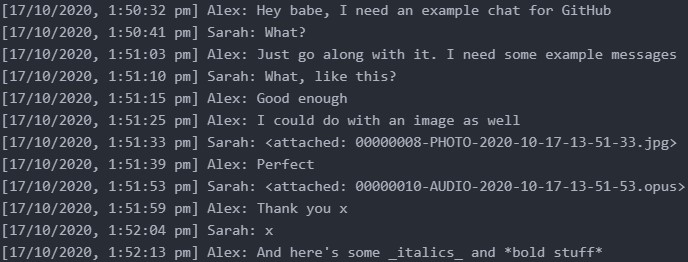
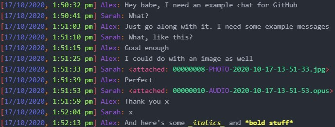

# WhatsApp Language Package

A language package for Atom to highlight exported WhatsApp chats.

Makes parts of messages easier to locate and understand while also making it prettier.

## Example:

### Before:

### After:

## Installation:

### Manual:

Move only the `grammars` folder, the `styles` folder, and `package.json` to `C:/Users/[your username]/github`

When in Atom, press `Crtl+Shift+F5` to refresh.
